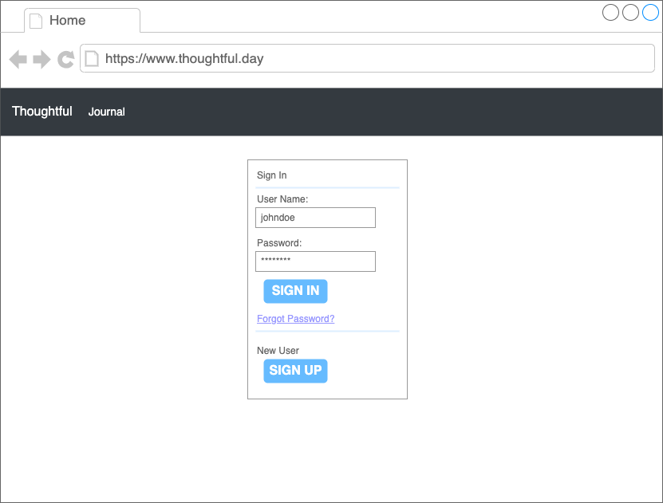
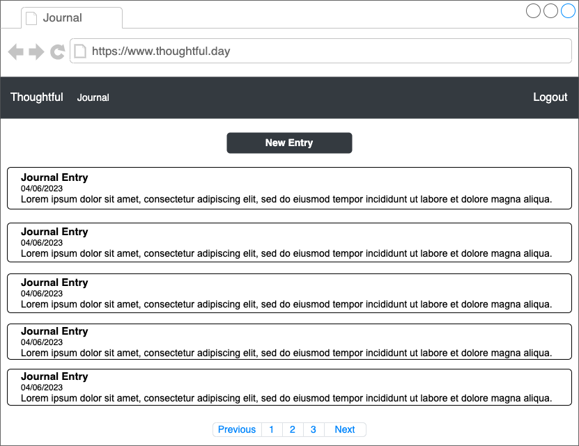
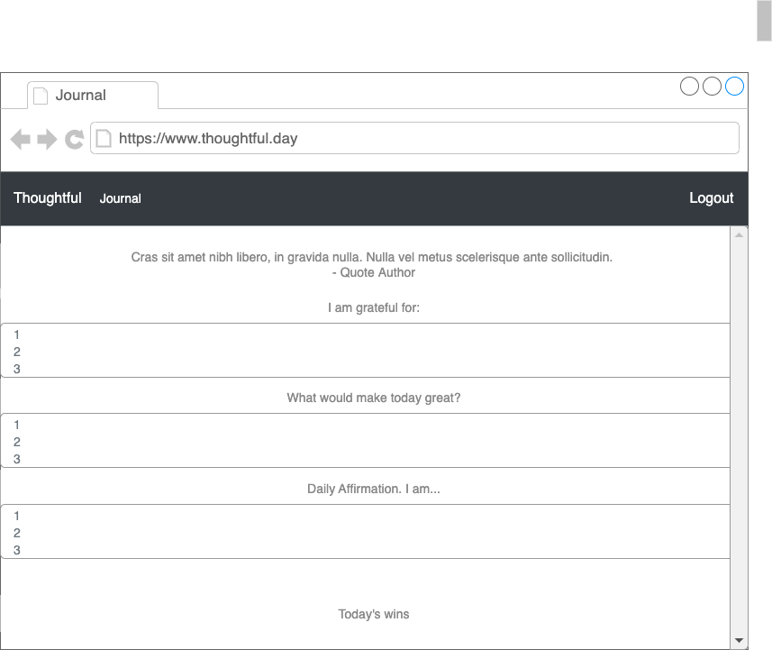
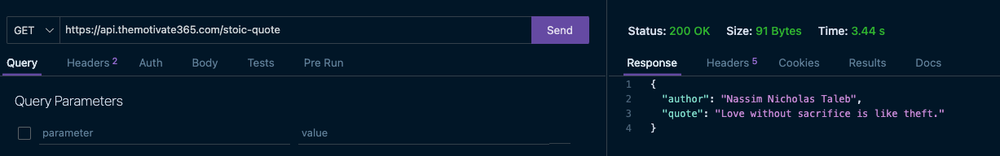
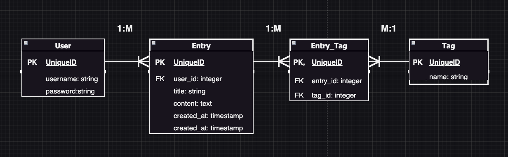
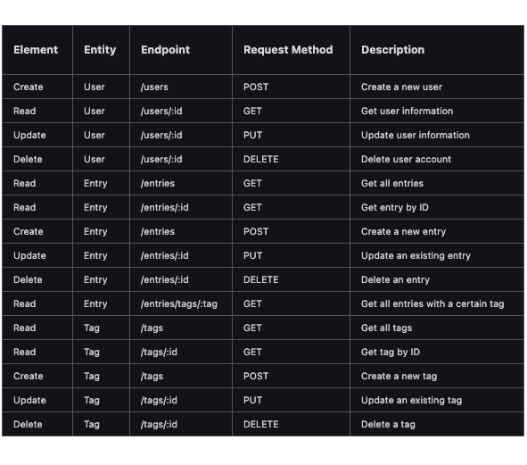

# Thoughtful.day

## Live Site: https://www.thoughtful.day/

## TL;DR:
Thoughtful.day will be a journaling platform where users will be able to use different types of journaling templates.

## Full Description:
Thoughtful.day will be a journaling platform that utilizes templates to help people document   their daily experience and personal growth in a private, secure digital space. Users can create   profiles, customize their settings, pick different templates, and begin to write their   entries, which can be tagged, organized, and found using an easy-to-navigate user  interface.

## Target Audience for a Journaling Platform: 
- People who like to journal
- People interested in mental health
- Students interested in keeping a research journal
- Professionals who want to keep a work journal for self or manager assessments
- Writers who want to setup prompts for themselves

## User Stories:
- As a user, I want to have guided prompts to help me journal
- As a user, I want to be able to tag my entries
- As a user, I want to have inspirational quotes to be put in the right mindset to journal
- As a user, my entries should be dated for searching purposes
- As a user, my entries should be searchable for reminiscing purposes

## MVP (Minimum Viable Product) Goals

- Allow users to create an account, log in, and log out securely
- Provide users the ability to add a journal entry
- Allow users to tag journal entries
- Generate inspirational quotes on top of an entry provided by a third-party API

## MMP (Minimum Marketable Product) or Stretch Goals
- Ability to delete journal entries
- Ability to edit journal entries
- Search functionality to go through entry
- Light/Dark mode
- Ability to start another journal type (A work journal would be next)
- Other journal type would need new template prompts and possible removal of quote section
- Share ability to be enacted based on journal type
- Ability to create template from form 

## Technologies
- Java Script
- HTML
- CSS
- Express
- Node (sequelize, ejs, crypto-js)
- Postgres
- Data API

## 🔍 Wireframes

## 🌟 API with Example

I will be using https://api.themotivate365.com/stoic-quote to retrieve stoicism quotes. The API provides a simple quote and author database and can provide one every day.

## 🔗 ERD (Entity Relationship Diagram)

## 🛣️ RESTful Routing Chart

## Installation Instructions
- Clone the repository:
git clone https://github.com/juanedcabrera/thoughtful.day.git

- Navigate to the project directory:
cd to the repository

- Install the required dependencies:
npm i cookie-parser crypto-js method-override nodemon

- Create a .env file at the root of the project and fill in the necessary environment variables:
PORT=8000
ENC_KEY=key
(For key you should put whichever key string you want to use in VARCHAR format)

- Start the server
Go to directory and hit nodemon

- Open the browser and go to http://localhost:8000

## Approach Taken

The aim of this journal project was to create a platform where users can journal, choose different journals, and have guided prompts. To achieve this goal, we adopted an iterative and user-centered design approach, which involved several key steps.

Firstly, I conducted research to gain a deeper understanding of our target users and their needs. This involved conducting user interviews, surveys, and analyzing existing journals and mental health apps. Based on our findings, I developed user personas and defined our design goals and requirements.

Next, I created wireframes and prototypes of the journal platform, which I tested with potential users to gather feedback and refine our designs. I also conducted usability testing to ensure that the platform was easy to use and understand.

Once I had finalized the design, I developed the platform using modern technologies, including HTML, CSS, JavaScript, Express and Node.js. I also implemented user authentication and database integration to ensure that users could securely and easily save and access their journal entries.

Finally, I launched the platform and gathered feedback from early users to continue improving the design and functionality. Throughout the project, I focused on creating a user-centered and accessible platform that empoIrs users to take control of their emotional wellbeing.

## Project Reflection

I think this was a very challenging project that involved front and back end technologies that were tough to wrap my head around. I think the biggest piece is the realization that writing code more and more, whether I fully understood it or not, helped me learn intensely. It was a week of full breakthroughs with Express and node as well Sequelize and deployment. 