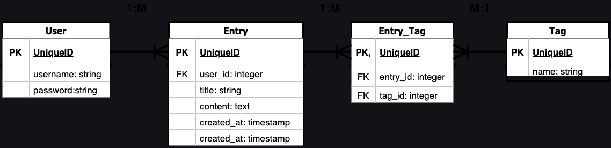

# Thoughtful.day

## ➡️ TL;DR:
Thoughtful.day will be a journaling platform where users will be able to use different types of journaling templates.

## 📝 Full Description:
Thoughtful.day will be a journaling platform that utilizes templates to help people document their daily experience and personal growth in a private, secure digital space. Users can create profiles, customize their settings, pick different templates, and begin to write their entries, which can be tagged, organized, and found using an easy-to-navigate user interface.

## 🎯 Target Audience for a journaling platform: 
- People who like to journal
- People interested in mental health
- Students interested in keeping a research journal
- Professionals who want to keep a work journal for self or manager assessments
- Writers who want to setup prompts for themselves

## 🗣️ User Stories:
As a user, I want have guided prompts to help me journal.
As a user, I want to be able to tag my entries.
As a user, I want to have inspirational quotes to be put in the right mindset to journal.
As a user, my entries should be dated for searching purposes
As a user, my entries should be searchable for reminiscing purposes

## 🚀 MVP (Minimum Viable Product) Goals

- Allow users to create an account, log in, and log out securely.
- Provide users the ability to add a journal entry
- Allows users to tag journal entries
- To have an API linked up for inspirational quotes to be generated on top of an entry

## 🌕 MMP (Minimum Marketable Product) or Stretch Goals
- Ability to delete journal entries
- Ability to edit journal entries
- Search functionality to go through entry
- Light/Dark mode
- Ability to start another journal type (A work journal would be next)
- Other journal type would need new template prompts and possible removal of quote section
- Share ability to be enacted based on journal type
- Ability to create template from form 

## 💻 Technologies Used
Java Script
HTML
CSS
Express
Node (sequelize, ejs, crypto-js)
Postgres
Data API

## 🔍 Wireframes

## 🌟 API with Example

I will be using https://api.themotivate365.com/stoic-quote to retrieve stoicism quotes. The API provides a simple quote and author database and can provide one every day.

## 🔗 ERD (Entity Relationship Diagram)

## 🛣️ RESTful Routing Chart
#